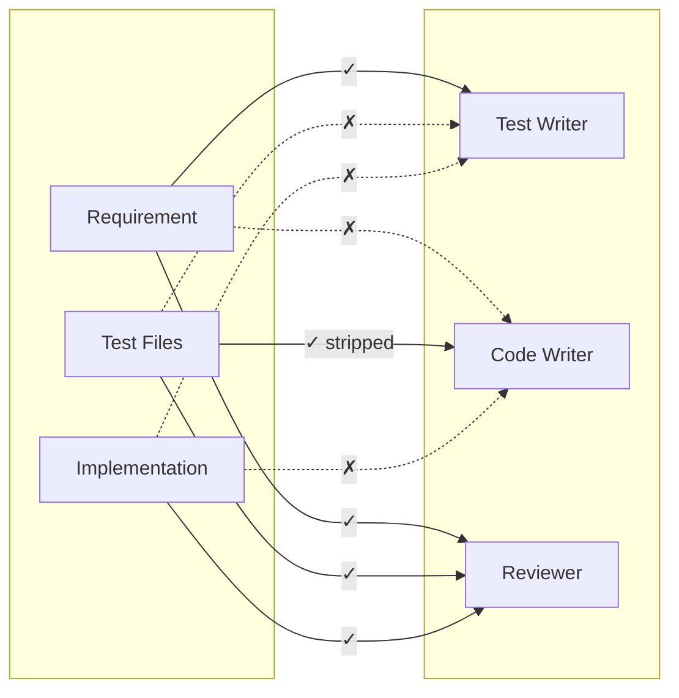

# Bon Cop Bad Cop - Adversarial Test-Driven Development (TDD) Plugin for Claude Code

Three-agent adversarial TDD loop: Test Writer (bad cop), Code Writer (suspect), and Reviewer (good cop) work together while keeping each other honest.

## Installation

### Option A: Via MadeByTokens Marketplace (Recommended)

See https://github.com/MadeByTokens/claude-code-plugins-madebytokens

### Option B: Direct Install

```bash
# Clone and install directly
git clone https://github.com/MadeByTokens/bon-cop-bad-cop.git
/plugin install ./bon-cop-bad-cop
```

## Quick Start

```bash
# Run a TDD loop (after installation)
/bon-cop-bad-cop:tdd-loop "Write a function add(a, b) that returns the sum of a and b"
```

## Example Requirements

Here are simple requirements to test the plugin, ordered by complexity:

### Beginner
```bash
# Prime number checker
/bon-cop-bad-cop:tdd-loop "Write a function is_prime(n) that returns True if n is prime, False otherwise"

# String reversal
/bon-cop-bad-cop:tdd-loop "Write a function reverse_string(s) that returns the reversed string"

# Factorial
/bon-cop-bad-cop:tdd-loop "Write a function factorial(n) that returns n! (n factorial)"
```

### Intermediate
```bash
# Classic FizzBuzz
/bon-cop-bad-cop:tdd-loop "Write a function fizzbuzz(n) that returns 'Fizz' for multiples of 3, 'Buzz' for multiples of 5, 'FizzBuzz' for both, otherwise the number as a string"

# Email validation
/bon-cop-bad-cop:tdd-loop "Write a function is_valid_email(email) that returns True if the email format is valid"

# Palindrome finder
/bon-cop-bad-cop:tdd-loop "Write a function longest_palindrome(s) that returns the longest palindromic substring"
```

### With Options
```bash
# Override auto-detected language with higher mutation threshold
/bon-cop-bad-cop:tdd-loop "Write a function is_prime(n)" --language rust --mutation-threshold 0.9

# Override to JavaScript with more iterations allowed
/bon-cop-bad-cop:tdd-loop "Write a function reverseString(s)" --language javascript --max-iterations 20
```

## Commands

| Command | Description |
|---------|-------------|
| `/bon-cop-bad-cop:tdd-loop "requirement"` | Start new TDD loop |
| `/bon-cop-bad-cop:tdd-status` | Check current loop status |
| `/bon-cop-bad-cop:cancel-tdd` | Cancel active loop |
| `/bon-cop-bad-cop:help` | Display plugin help and usage |

### Options for tdd-loop

- `--requirement-file path/to/file.md` - Load requirement from markdown file
- `--max-iterations N` - Maximum iterations (default: 15)
- `--mutation-threshold 0.85` - Required mutation score (default: 0.8)
- `--test-scope unit|integration|both` - Test scope (default: unit)
- `--language LANG` - Override auto-detection (python, javascript, typescript, rust, go, java, ruby)

### Using a Requirement File

For complex requirements, create a markdown file and use `--requirement-file`:

```bash
# Create a requirement file with detailed specs
cat > requirement.md << 'EOF'
Write a function `calculate_tax(income, deductions)` that:
- Accepts income as a positive number
- Accepts deductions as a list of {amount, category} objects
- Returns the tax owed based on progressive brackets
- Handles edge cases: zero income, negative values, empty deductions
EOF

# Run TDD loop with the file
/bon-cop-bad-cop:tdd-loop --requirement-file requirement.md

# Or combine with inline notes for run-specific tweaks
/bon-cop-bad-cop:tdd-loop "Focus on edge cases, ignore performance" --requirement-file requirement.md
```

When both are provided, the inline text is appended as "Additional Notes" to the file content.

## How It Works

The plugin orchestrates three specialized agents in sequence:


**Key Innovation:** Each agent runs in isolation with different context. The Code Writer never sees the original requirement - only the tests. This enforces true TDD behavior.

## The Three Agents

### Test Writer (Bad Cop)
- **Role:** Write comprehensive tests that catch cheating
- **Sees:** Requirements, mutation survivors, feedback about tests
- **Never sees:** Implementation code

### Code Writer (Suspect)
- **Role:** Implement code that passes all tests
- **Sees:** Test files only (comments may be stripped)
- **Never sees:** Original requirements

### Reviewer (Good Cop)
- **Role:** Validate both tests and implementation
- **Sees:** Everything
- **Actions:** Run tests, detect flakiness, detect cheating, mutation testing
- **Issues:** Final verdict that determines loop flow

### Information Isolation

The key to preventing collusion is strict information barriers:



- **Test Writer** derives tests from requirements, never sees implementation
- **Code Writer** derives logic from test behavior, never sees requirements or comments
- **Reviewer** sees everything, filters feedback to prevent information leakage

---

## Philosophy

**Why adversarial?** Single-agent coding tends to "cheat" by writing tests that match the implementation rather than the spec. Three agents with different goals keep each other honest.

**Why isolation?** If the Code Writer sees the requirement, it might implement shortcuts that pass tests but miss intent. By only seeing tests, it must implement *behavior*, not just keywords.

**Why mutation testing?** Passing tests prove nothing if the tests themselves are weak. Mutation testing catches test suites that would pass broken code.

---

## Repository Structure

```
bon-cop-bad-cop/
├── .claude-plugin/
│   └── plugin.json           # Plugin manifest
├── agents/                   # Agent definitions
│   ├── test-writer.md
│   ├── code-writer.md
│   └── reviewer.md
├── commands/                 # Slash commands
│   ├── tdd-loop.md
│   ├── tdd-status.md
│   ├── cancel-tdd.md
│   └── help.md
└── README.md
```

---

## Features

- **Information Isolation** - Each agent only sees what they should
- **Mutation Testing** - Ensures tests actually catch bugs
- **Cheating Detection** - Identifies hardcoded/lookup table implementations
- **Flakiness Detection** - Runs tests multiple times
- **State Persistence** - Loop state saved in `.tdd-state.json`
- **Requirement Grounding** - Original requirement re-injected every iteration to prevent drift
- **Trail Log** - Detailed audit log in `.tdd-loop.log` for debugging and verification

## Built-in Capabilities

The following capabilities are embedded directly in the agents and commands (no external dependencies):

### Cheating Detection (in Reviewer)
Analyzes implementation code for patterns indicating gaming rather than genuine logic:
- Hardcoded returns matching test expectations
- Lookup tables with test inputs as keys
- Test environment detection (`if 'pytest' in sys.modules`)
- Excessive conditional chains

### Flaky Test Detection (in Reviewer)
Runs test suite 3 times and compares results. Any test with inconsistent outcomes is flagged as flaky and must be fixed before proceeding.

### Comment Stripping (in tdd-loop orchestrator)
Removes comments and docstrings from test files before Code Writer sees them. Supports Python, JavaScript/TypeScript, Rust, Go, Java, and C/C++. This ensures Code Writer derives intent from test *behavior*, not explanatory comments.

### Requirement Alignment Check (in Reviewer)
Every iteration, the Reviewer verifies that tests still align with the original requirement. If tests have drifted beyond scope, the loop corrects back to the original requirement.

## Requirements

**For mutation testing (optional but recommended):**

Python:
```bash
pip install pytest mutmut
```

JavaScript:
```bash
npm install -D jest @stryker-mutator/core
```

Rust:
```bash
cargo install cargo-mutants
```

## Troubleshooting

### "Unknown slash command: tdd-loop"

Make sure the plugin is installed:
```bash
# Check installed plugins
/plugin list

# If not installed:
/plugin install /path/to/bon-cop-bad-cop
```

### Loop stops after first agent

This is expected if the Task tool invocations aren't working correctly. Check:
- `.tdd-state.json` has `"active": true`
- All agent files exist in `agents/`
- Run `/bon-cop-bad-cop:tdd-status` to see current state

### Tests not running / Mutation testing skipped

Install the required tools for your language (see Requirements above).

## Contributing

This is a community-built plugin. Contributions welcome!

## License

MIT
