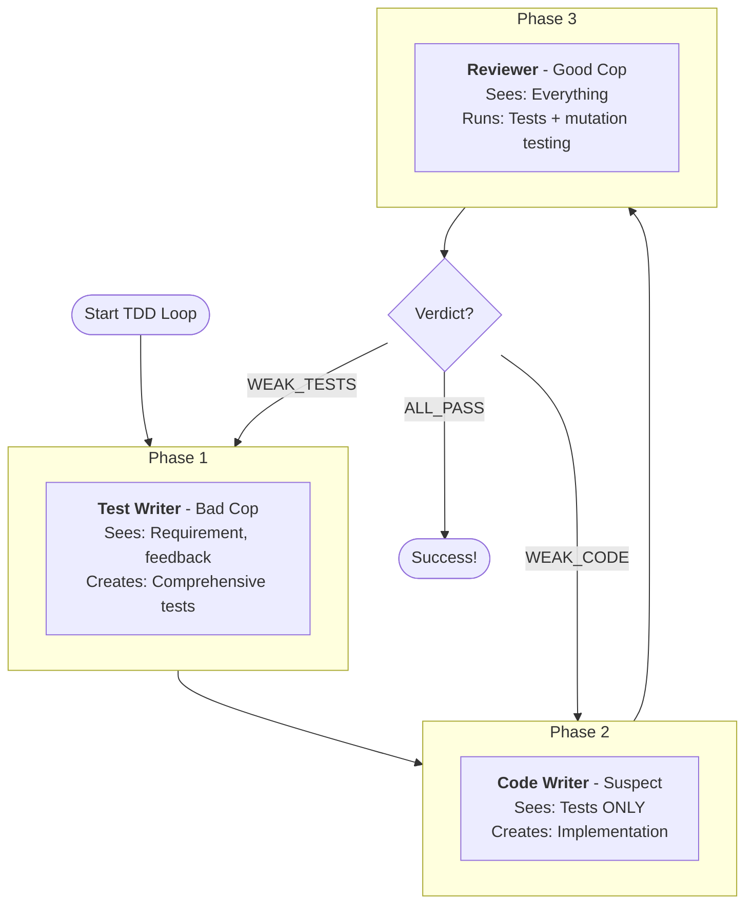
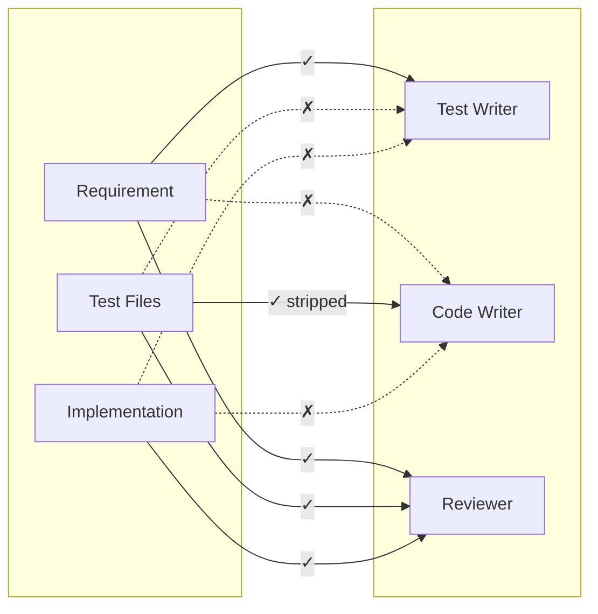

# Bon Cop Bad Cop - Adversarial Test-Driven Development (TDD) Plugin for Claude Code

Three-agent adversarial TDD loop: Test Writer (bad cop), Code Writer (suspect), and Reviewer (good cop) work together while keeping each other honest.

## Installation

### Option A: Via MadeByTokens Marketplace (Recommended)

See https://github.com/MadeByTokens/claude-code-plugins-madebytokens

### Option B: Direct Install

```bash
# Clone and install directly
git clone https://github.com/MadeByTokens/bon-cop-bad-cop.git
/plugin install ./bon-cop-bad-cop
```

## Quick Start

```bash
# Run a TDD loop (after installation)
/bon-cop-bad-cop:tdd-loop "Write a function add(a, b) that returns the sum of a and b"
```

## Example Requirements

Here are simple requirements to test the plugin, ordered by complexity:

### Beginner
```bash
# Prime number checker
/bon-cop-bad-cop:tdd-loop "Write a function is_prime(n) that returns True if n is prime, False otherwise"

# String reversal
/bon-cop-bad-cop:tdd-loop "Write a function reverse_string(s) that returns the reversed string"

# Factorial
/bon-cop-bad-cop:tdd-loop "Write a function factorial(n) that returns n! (n factorial)"
```

### Intermediate
```bash
# Classic FizzBuzz
/bon-cop-bad-cop:tdd-loop "Write a function fizzbuzz(n) that returns 'Fizz' for multiples of 3, 'Buzz' for multiples of 5, 'FizzBuzz' for both, otherwise the number as a string"

# Email validation
/bon-cop-bad-cop:tdd-loop "Write a function is_valid_email(email) that returns True if the email format is valid"

# Palindrome finder
/bon-cop-bad-cop:tdd-loop "Write a function longest_palindrome(s) that returns the longest palindromic substring"
```

### With Options
```bash
# Force Python with higher mutation threshold
/bon-cop-bad-cop:tdd-loop "Write a function is_prime(n)" --language python --mutation-threshold 0.9

# JavaScript with more iterations allowed
/bon-cop-bad-cop:tdd-loop "Write a function reverseString(s)" --language javascript --max-iterations 20
```

## Commands

| Command | Description |
|---------|-------------|
| `/bon-cop-bad-cop:tdd-loop "requirement"` | Start new TDD loop |
| `/bon-cop-bad-cop:tdd-status` | Check current loop status |
| `/bon-cop-bad-cop:cancel-tdd` | Cancel active loop |
| `/bon-cop-bad-cop:help` | Display plugin help and usage |

### Options for tdd-loop

- `--requirement-file path/to/file.md` - Load requirement from markdown file
- `--max-iterations N` - Maximum iterations (default: 15)
- `--mutation-threshold 0.85` - Required mutation score (default: 0.8)
- `--test-scope unit|integration|both` - Test scope (default: unit)
- `--language python|javascript|rust` - Force language (default: auto-detect)

### Using a Requirement File

For complex requirements, create a markdown file and use `--requirement-file`:

```bash
# Create a requirement file with detailed specs
cat > requirement.md << 'EOF'
Write a function `calculate_tax(income, deductions)` that:
- Accepts income as a positive number
- Accepts deductions as a list of {amount, category} objects
- Returns the tax owed based on progressive brackets
- Handles edge cases: zero income, negative values, empty deductions
EOF

# Run TDD loop with the file
/bon-cop-bad-cop:tdd-loop --requirement-file requirement.md

# Or combine with inline notes for run-specific tweaks
/bon-cop-bad-cop:tdd-loop "Focus on edge cases, ignore performance" --requirement-file requirement.md
```

When both are provided, the inline text is appended as "Additional Notes" to the file content.

## How It Works

The plugin orchestrates three specialized agents in sequence:



**Key Innovation:** Each agent runs in isolation with different context. The Code Writer never sees the original requirement - only the tests. This enforces true TDD behavior.

## The Three Agents

### Test Writer (Bad Cop)
- **Role:** Write comprehensive tests that catch cheating
- **Sees:** Requirements, mutation survivors, feedback about tests
- **Never sees:** Implementation code

### Code Writer (Suspect)
- **Role:** Implement code that passes all tests
- **Sees:** Test files only (comments may be stripped)
- **Never sees:** Original requirements

### Reviewer (Good Cop)
- **Role:** Validate both tests and implementation
- **Sees:** Everything
- **Actions:** Run tests, detect flakiness, detect cheating, mutation testing
- **Issues:** Final verdict that determines loop flow

### Information Isolation

The key to preventing collusion is strict information barriers:



- **Test Writer** derives tests from requirements, never sees implementation
- **Code Writer** derives logic from test behavior, never sees requirements or comments
- **Reviewer** sees everything, filters feedback to prevent information leakage

---

## Repository Structure

```
bon-cop-bad-cop/
├── .claude-plugin/
│   └── plugin.json           # Plugin manifest
├── agents/                   # Agent definitions
│   ├── test-writer.md
│   ├── code-writer.md
│   └── reviewer.md
├── commands/                 # Slash commands
│   ├── tdd-loop.md
│   ├── tdd-status.md
│   ├── cancel-tdd.md
│   └── help.md
├── tools/                    # Helper scripts
│   ├── detect_cheating.py
│   ├── detect_flaky.py
│   └── strip_comments.py
├── README.md
└── QUICKSTART.md
```

---

## Features

- **Information Isolation** - Each agent only sees what they should
- **Mutation Testing** - Ensures tests actually catch bugs
- **Cheating Detection** - Identifies hardcoded/lookup table implementations
- **Flakiness Detection** - Runs tests multiple times
- **State Persistence** - Loop state saved in `.tdd-state.json`

## Helper Tools

The `plugins/bon-cop-bad-cop/tools/` directory contains standalone utilities that enforce the adversarial integrity of the TDD loop. These can also be run independently outside the plugin.

### detect_cheating.py

Scans implementation code for patterns indicating the Code Writer is "gaming" the tests rather than implementing genuine logic.

**Patterns detected:**
- Hardcoded returns matching test expectations
- Lookup tables with test inputs as keys
- Test environment detection (`pytest` in `sys.modules`, `CI` env vars)
- Excessive conditional chains matching specific test cases

**Usage:**
```bash
# Human-readable output
python tools/detect_cheating.py implementation.py test_implementation.py

# JSON output for programmatic use
python tools/detect_cheating.py implementation.py test_implementation.py --json
```

**Why it matters:** Without this, the Code Writer could pass all tests with `if input == 2: return 5` style cheating instead of real logic.

---

### detect_flaky.py

Runs test suites multiple times to identify non-deterministic tests. Flaky tests must be fixed before mutation testing can provide meaningful results.

**Supported frameworks:** pytest, Jest, Cargo (auto-detected)

**Usage:**
```bash
# Run tests 3 times (default), auto-detect framework
python tools/detect_flaky.py tests/

# Run 5 times with explicit framework
python tools/detect_flaky.py tests/ --runs 5 --framework pytest

# JSON output
python tools/detect_flaky.py tests/ --json
```

**Why it matters:** A flaky test that passes 2/3 times will cause false positives in mutation testing and waste iterations.

---

### strip_comments.py

Removes comments and docstrings from test files before the Code Writer sees them. This is a key anti-collusion measure.

**Supported languages:** Python, JavaScript/TypeScript

**Usage:**
```bash
# Print stripped code to stdout
python tools/strip_comments.py test_example.py

# Write to file
python tools/strip_comments.py test_example.py test_example_stripped.py
```

**Why it matters:** The Code Writer should derive intent from test *behavior*, not from explanatory comments. If the Test Writer writes `# should handle negative numbers`, the Code Writer might just add a negative number check without understanding why. Stripping comments forces the Code Writer to understand the tests through their assertions.

---

## Requirements

**For mutation testing (optional but recommended):**

Python:
```bash
pip install pytest mutmut
```

JavaScript:
```bash
npm install -D jest @stryker-mutator/core
```

Rust:
```bash
cargo install cargo-mutants
```

## Troubleshooting

### "Unknown slash command: tdd-loop"

Make sure the plugin is installed:
```bash
# Check installed plugins
/plugin list

# If not installed:
/plugin install /path/to/bon-cop-bad-cop
```

### Loop stops after first agent

This is expected if the Task tool invocations aren't working correctly. Check:
- `.tdd-state.json` has `"active": true`
- All agent files exist in `agents/`
- Run `/bon-cop-bad-cop:tdd-status` to see current state

### Tests not running / Mutation testing skipped

Install the required tools for your language (see Requirements above).

## Contributing

This is a community-built plugin. Contributions welcome!

## License

MIT
