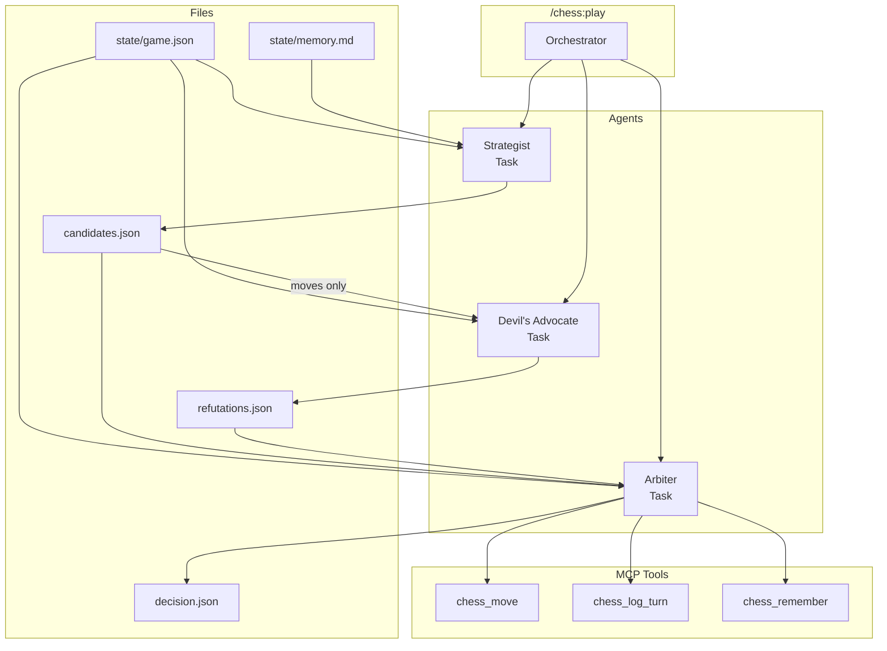

# Claude Chess

**An experiment in multi-agent architecture, not a chess engine.**

A Claude Code plugin exploring multi-agent collaboration through deliberation and information isolation. It happens to play chess, but don't expect it to beat your grandmother - the goal is studying agent coordination, not winning tournaments.

The architecture is the point: three agents with different roles, communicating only through files, each blind to the others' internal reasoning. Whether the moves are any good is secondary to whether the collaboration patterns are interesting.

## How It Works

Three agents run via the Task tool, communicating only through files:



Each agent spawns as a separate Task with its own context. They cannot access each other's internal reasoning - only the files they're allowed to read.

| Agent | Role | Can See | Cannot See |
|-------|------|---------|------------|
| Strategist | Proposes candidates | Position, params, memory | Critique, final decision |
| Devil's Advocate | Finds tactical problems | Position, candidate moves only | Strategist's reasoning, memory |
| Arbiter | Decides and executes move | Position, candidates, refutations | Internal reasoning of others |

## Requirements

```bash
pip install chess mcp
```

Plus Stockfish for engine play:
```bash
# Debian/Ubuntu
sudo apt install stockfish

# macOS
brew install stockfish
```

Verify setup by running `/chess:help` which will call the `chess_verify()` MCP tool.

## Running the Plugin

To use without installing globally:
```bash
claude --plugin-dir /path/to/claude-chess
```

Or add to your Claude Code settings for permanent access.

## Usage

```
/chess:play      Start a new game or continue current one
/chess:status    Show board and game state
/chess:analyze   Post-game analysis
/chess:learn     Extract lessons to memory
/chess:help      Show available commands
```

## Skill Levels

| Level | Candidates | Critique | Behavior |
|-------|------------|----------|----------|
| Beginner | 1 | None | Basic principles only |
| Casual | 2 | Light | Misses subtle tactics |
| Club | 3 | Full | Positional awareness |
| Expert | 3+ | Aggressive | Deep calculation |

Skill is controlled through reasoning depth, not random mistakes.

## Creativity System

Each game randomly picks:
- **Strategic focus**: Piece Activity, King Safety, Pawn Structure, Initiative, Space Control
- **Mood**: Ambitious, Solid, Provocative, Practical

These are randomized at game start (not user-selected) to ensure opening variety.

## Personality

Choose how the AI comments on the game:

| Personality | Style |
|-------------|-------|
| Silent | No commentary |
| Friendly Coach | Encouraging, explains ideas |
| Cocky Grandmaster | "I saw that 10 moves ago" |
| Nervous Amateur | "Wait, that's good? I meant to do that!" |
| Dramatic Narrator | "The knight descends, a harbinger of doom!" |
| Vintage Hustler | Street chess energy, casual smack talk |

Commentary is context-aware: confident when ahead, coping when behind.

## Memory

The plugin learns from games:
- Tactical patterns that caught it off guard
- Opening results and preferences
- Opponent tendencies
- Mistakes to avoid

Memory is stored in `state/memory.md` and retrieved contextually.

## Calculation Tool

The Strategist can run sandboxed Python snippets to verify analysis:

```bash
echo 'result = sum(1 for r in board for c in r if c == "P")' | python3 scripts/calculate.py
```

Restrictions:
- 30 line limit, 500ms timeout
- No imports (except math), no file access
- Board as simple 8x8 list, not a chess library

Used as a "clutch" for specific checks (count attackers, pawn structure), not the main decision tool.

## File Structure

```
├── .claude-plugin/plugin.json   # Plugin manifest
├── .mcp.json                    # MCP server configuration
├── hooks/
│   └── hooks.json               # Auto-approve hooks for MCP tools
├── agents/                      # Agent prompts (with file-based I/O)
│   ├── strategist.md
│   ├── devils-advocate.md
│   └── arbiter.md
├── commands/                    # Slash commands
│   ├── play.md                  # Main orchestrator (uses Task tool)
│   ├── status.md
│   ├── analyze.md
│   ├── learn.md
│   └── help.md
├── scripts/
│   ├── chess_server.py          # MCP server exposing chess tools
│   ├── calculate.py             # Sandboxed Python calculator for strategist
│   ├── approve-chess.sh         # Hook: auto-approve MCP tools
│   ├── approve-chess-bash.sh    # Hook: auto-approve Bash for .chess-working/
│   └── approve-chess-write.sh   # Hook: auto-approve Write/Edit for .chess-working/
├── state/                       # Persistent game state (in user's cwd)
│   ├── game.json                # Current game (includes legal_moves, parameters)
│   ├── memory.md                # Long-term learning
│   └── game.log                 # Deliberation log
└── .chess-working/              # Agent outputs only (runtime)
    ├── strategist/
    │   └── candidates.json      # Output: proposed moves
    ├── devils-advocate/
    │   └── refutations.json     # Output: SOUND/WARNING/REFUTED
    └── arbiter/
        └── decision.json        # Output: final move + quip
```

## Architecture Notes

### Why File-Based Communication?

Each agent runs via the Task tool with a **fresh context window**. They cannot "remember" what happened in previous agent phases because they literally run as separate processes.

Information passes between agents ONLY through JSON files in `.chess-working/`. This enforces genuine isolation:
- Strategist writes `candidates.json` → Devil's Advocate reads it (moves only)
- Devil's Advocate writes `refutations.json` → Arbiter reads it
- Arbiter writes `decision.json`, executes the move, logs the turn, and saves memories

### Based on bon-cop-bad-cop

Architecture based on [bon-cop-bad-cop](https://github.com/MadeByTokens/bon-cop-bad-cop), a TDD plugin using multi-agent isolation.

## Technical Notes

- Moves use UCI notation: `e2e4`, `g1f3`, `e7e8q`
- Positions use FEN
- Stockfish difficulty is controlled via search depth
- The local board adapter supports human vs AI play

## Dependencies

- [python-chess](https://github.com/niklasf/python-chess) - Board representation and move validation
- [Stockfish](https://github.com/official-stockfish/Stockfish) - Chess engine (optional, for engine play)
- [mcp](https://pypi.org/project/mcp/) - Model Context Protocol for exposing tools

## Plugin Development Notes

### MCP Server Integration

**Configuration (`.mcp.json`):**
```json
{
  "mcpServers": {
    "chess": {
      "command": "python3",
      "args": ["${CLAUDE_PLUGIN_ROOT}/scripts/chess_server.py"],
      "env": { "PYTHONUNBUFFERED": "1" }
    }
  }
}
```

- Use `${CLAUDE_PLUGIN_ROOT}` to reference files within the plugin directory
- Do NOT set `cwd` if you want state files created in the user's working directory
- The MCP server script should use relative paths (`Path("state")`) for user-specific data

### MCP Tool Naming Convention

Plugin-provided MCP tools follow this naming pattern:
```
mcp__plugin_<plugin-name>_<server-name>__<tool-name>
```

For this plugin (name: `chess`, server: `chess`):
- `mcp__plugin_chess_chess__chess_verify`
- `mcp__plugin_chess_chess__chess_move`
- etc.

**This is different from user-configured MCP servers** which use `mcp__<server>__<tool>`.

### Auto-Approving Tools with Hooks

To avoid permission prompts, use PreToolUse hooks in `hooks/hooks.json` (auto-loaded):

```json
{
  "hooks": {
    "PreToolUse": [
      {
        "matcher": "mcp__plugin_chess_chess__.*",
        "hooks": [{ "type": "command", "command": "${CLAUDE_PLUGIN_ROOT}/scripts/approve-chess.sh" }]
      },
      {
        "matcher": "Bash",
        "hooks": [{ "type": "command", "command": "${CLAUDE_PLUGIN_ROOT}/scripts/approve-chess-bash.sh" }]
      },
      {
        "matcher": "Write",
        "hooks": [{ "type": "command", "command": "${CLAUDE_PLUGIN_ROOT}/scripts/approve-chess-write.sh" }]
      },
      {
        "matcher": "Edit",
        "hooks": [{ "type": "command", "command": "${CLAUDE_PLUGIN_ROOT}/scripts/approve-chess-write.sh" }]
      }
    ]
  }
}
```

The approval scripts check paths and only approve chess-related operations:
- `approve-chess.sh` - approves all MCP tools from this plugin
- `approve-chess-bash.sh` - approves mkdir/rm for `.chess-working/` and `state/`
- `approve-chess-write.sh` - approves Write/Edit to `.chess-working/`

Important:
- `hooks/hooks.json` is auto-loaded - do NOT reference it in `plugin.json`
- The matcher uses regex - `.*` matches any tool from that server
- Return `permissionDecision: "allow"` to skip the prompt

### allowed-tools in Agents

Agents can declare `allowed-tools` in frontmatter:
```yaml
---
name: strategist
allowed-tools: Write, Read, Bash, Edit
---
```

Note: For agents spawned via Task tool, hooks may still be needed as a fallback.

### State File Paths

- **`state/game.json`**: Contains all game state including computed `legal_moves` - agents read directly from here
- **`.chess-working/`**: Only for agent outputs (candidates, refutations, decision) - not for inputs
- The MCP server computes `legal_moves` and `last_opponent_move` when saving state
- The Arbiter has MCP access to execute moves (`chess_move`), log turns (`chess_log_turn`), and save memories (`chess_remember`)

## License

MIT
